# Dokumentasi Sequence Diagram - Calico's Pet Care
File ini berisi seluruh kode Sequence Diagram lengkap (Total 11 Diagram). Salin kode di dalam blok `mermaid` satu per satu ke https://mermaid.live/ untuk diubah menjadi gambar.

## 1. Sequence Diagram: Login (Admin & Kasir)
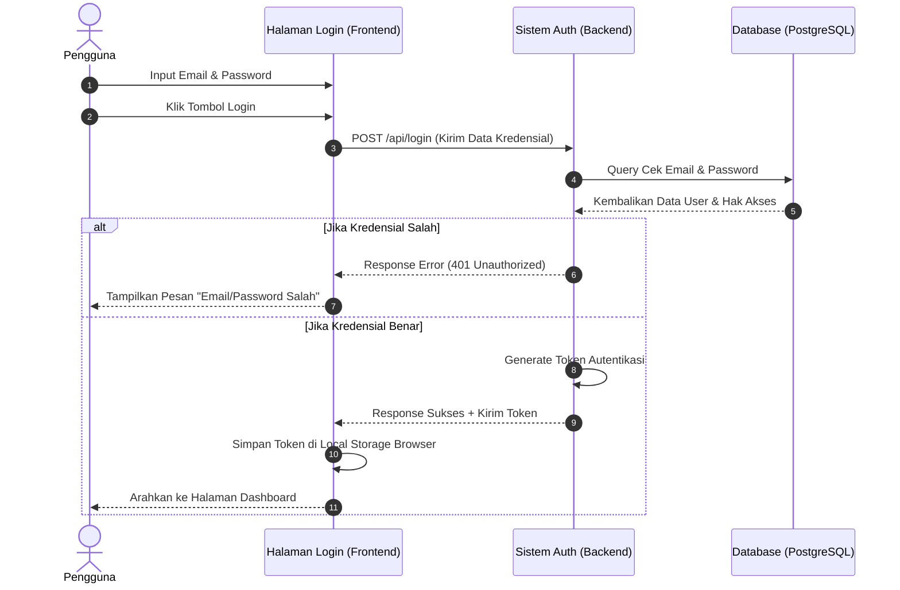

## 2. Sequence Diagram: Transaksi Kasir (Sistem POS)
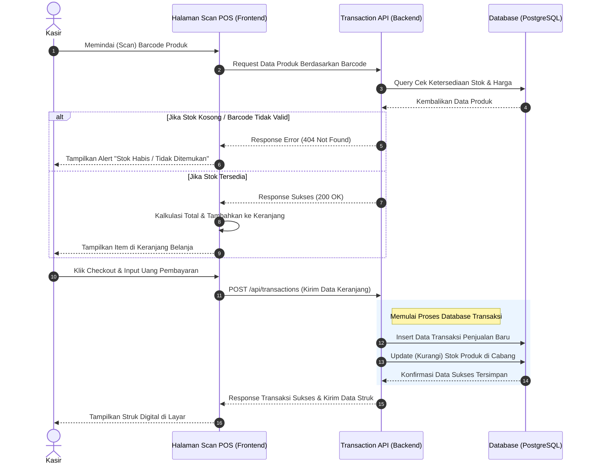

## 3. Sequence Diagram: Registrasi Akun Kasir (Oleh Admin)
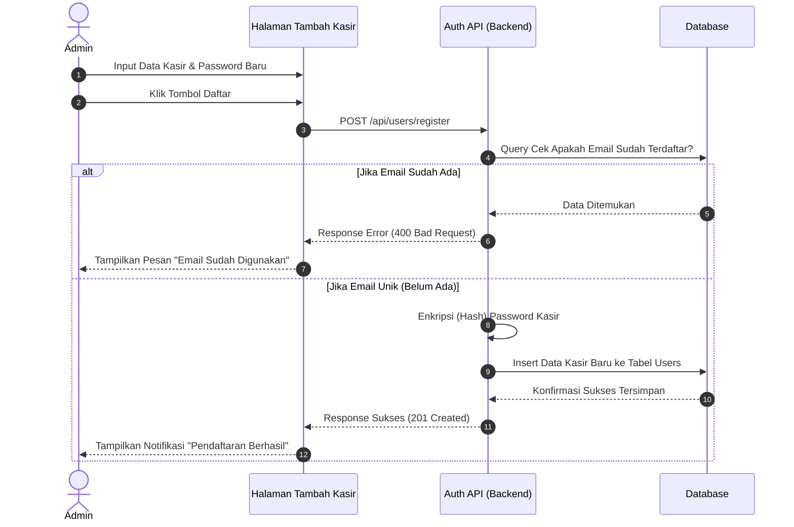

## 4. Sequence Diagram: Kelola Produk (Khusus Admin)
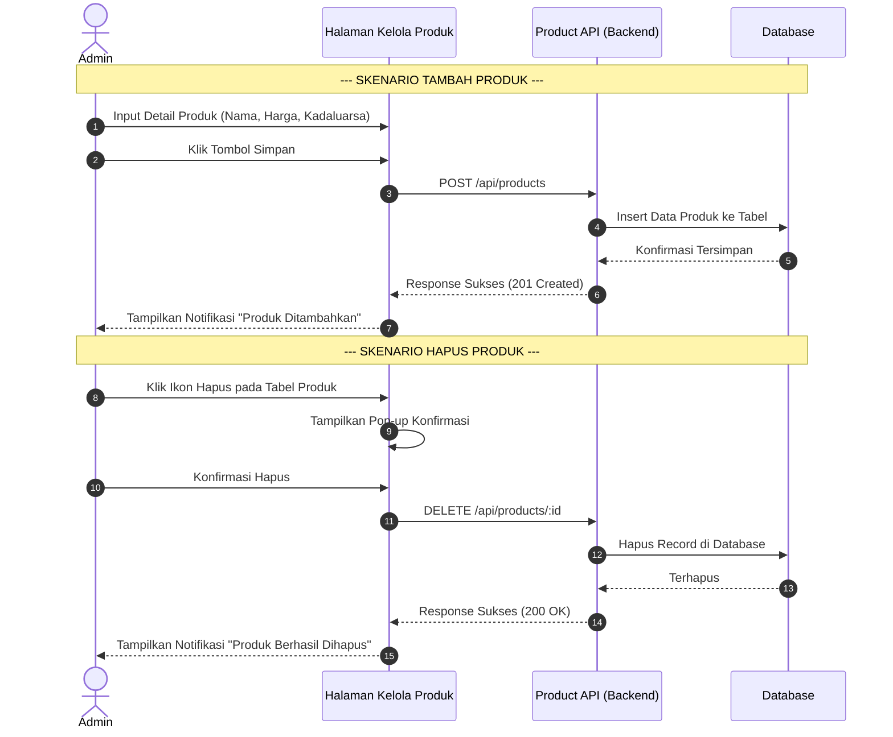

## 5. Sequence Diagram: Transfer Barang Keluar (Admin)
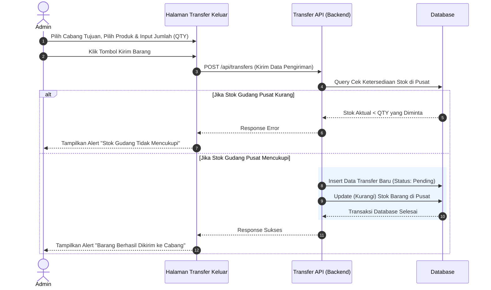

## 6. Sequence Diagram: Katalog Produk (Khusus Kasir)
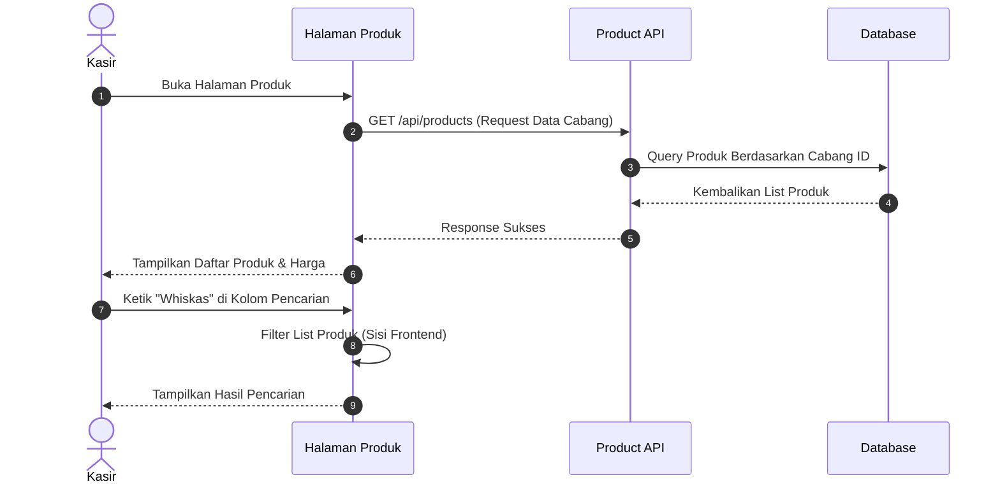

## 7. Sequence Diagram: Konfirmasi Transfer Masuk (Kasir)
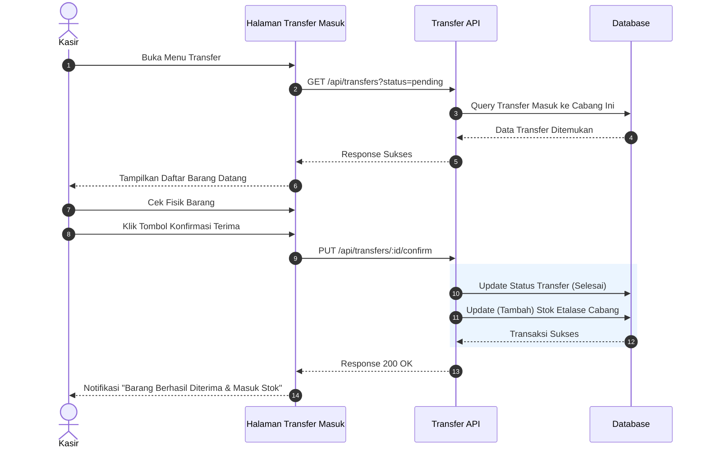

## 8. Sequence Diagram: Dashboard Utama (Admin - Laporan & FEFO)
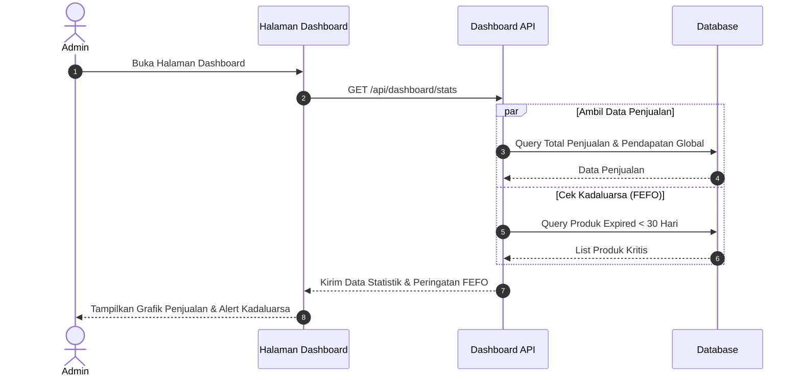

## 9. Sequence Diagram: Dashboard Kasir
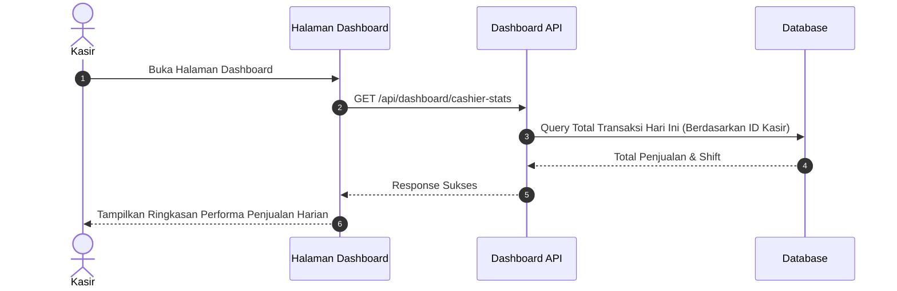

## 10. Sequence Diagram: Laporan Penjualan (Admin Unduh File)
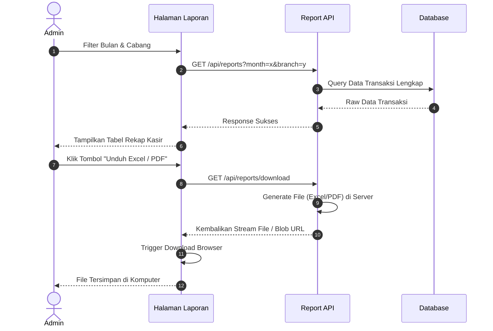

## 11. Sequence Diagram: Manajemen Profil & Logout
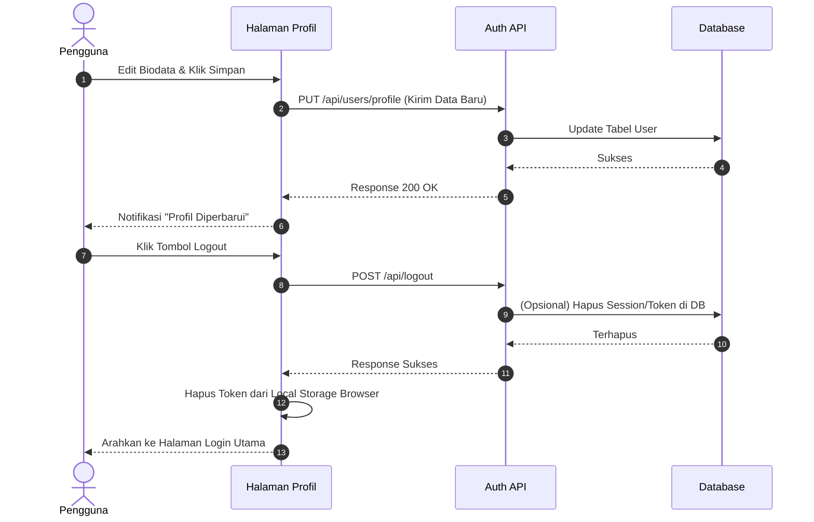
