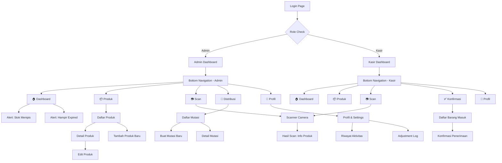
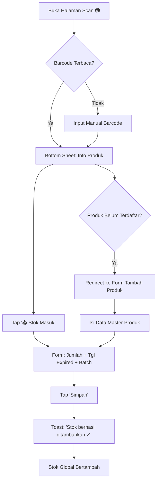
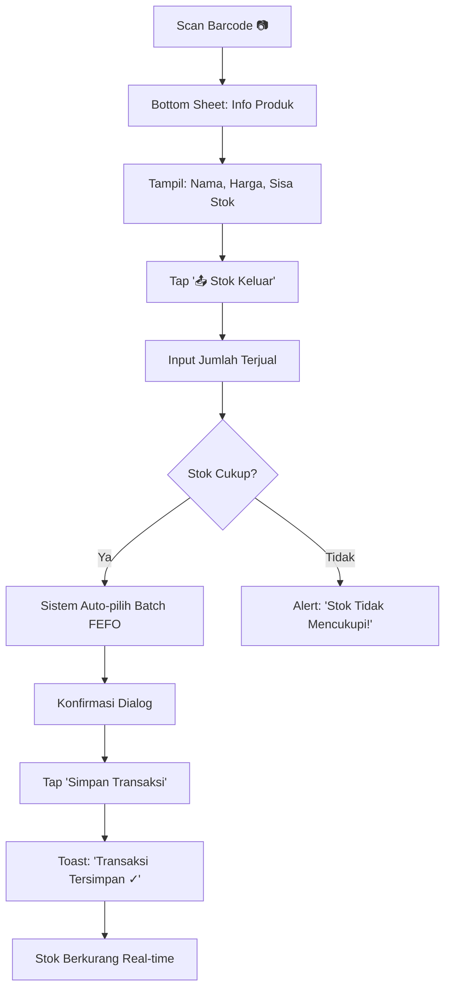
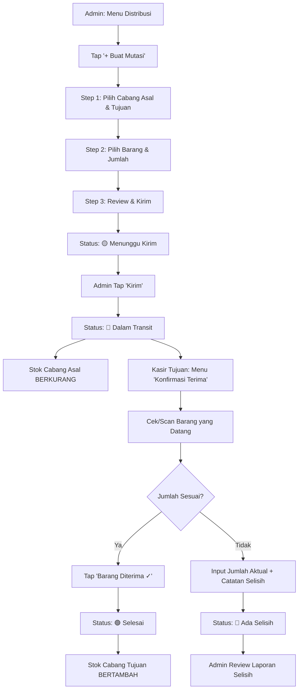

# Frontend Implementation Plan — Calico's Pet Care Inventory System

## Ringkasan Proyek

Membangun **Mobile-First Web Application** untuk manajemen stok dan distribusi produk di Toko Calico's Pet Care. Aplikasi didesain khusus untuk penggunaan via HP oleh **Admin** dan **Kasir**, dengan fokus pada kecepatan operasional, akurasi data, dan kemudahan navigasi.

---

## 1. Tech Stack

| Kategori | Teknologi | Alasan |
|:---|:---|:---|
| **Bundler** | Vite | Hot reload instan, build cepat |
| **Framework** | React 18+ | Komponen reusable, ekosistem besar |
| **Styling** | Vanilla CSS (CSS Modules) | Kontrol penuh, tanpa dependency tambahan |
| **Routing** | React Router v6 | Standar routing untuk React SPA |
| **State** | React Context + useReducer | Cukup untuk skala ini, tanpa over-engineering |
| **Icons** | Lucide React | Ringan, modern, konsisten |
| **Charts** | Recharts | Dashboard visualization yang ringan |
| **Barcode** | html5-qrcode | Akses kamera HP untuk scan barcode |
| **Font** | Google Fonts — **Inter** | Modern, highly readable, professional |

> [!NOTE]
> Backend belum dibahas di plan ini. Untuk sementara, data akan di-mock menggunakan JSON statis atau localStorage agar frontend bisa dikembangkan secara independen.

---

## 2. Design System

### 2.1 Color Palette

Tema utama: **Dark Mode** dengan aksen warna teal/cyan yang memberikan kesan profesional dan modern untuk pet shop.

```
/* === CORE COLORS === */
--color-bg-primary:       #0F1117;       /* Background utama (gelap) */
--color-bg-secondary:     #1A1D27;       /* Card / Surface */
--color-bg-tertiary:      #242837;       /* Input fields, elevated surfaces */

/* === ACCENT — Teal/Cyan (Identitas Calico's) === */
--color-accent:           #00D4AA;       /* Primary accent */
--color-accent-hover:     #00E8BC;       /* Hover state */
--color-accent-subtle:    rgba(0, 212, 170, 0.12); /* Subtle background */

/* === SEMANTIC COLORS === */
--color-success:          #22C55E;       /* Stok aman, barang diterima */
--color-warning:          #F59E0B;       /* Stok menipis, hampir expired */
--color-danger:           #EF4444;       /* Expired, error, kritis */
--color-info:             #3B82F6;       /* Info, dalam perjalanan */

/* === TEXT === */
--color-text-primary:     #F1F5F9;       /* Judul, teks utama */
--color-text-secondary:   #94A3B8;       /* Deskripsi, label */
--color-text-muted:       #64748B;       /* Placeholder, disabled */

/* === BORDERS === */
--color-border:           #2A2E3D;       /* Border umum */
--color-border-focus:     #00D4AA;       /* Focus state */
```

### 2.2 Typography

```
/* === FONT FAMILY === */
--font-primary: 'Inter', -apple-system, BlinkMacSystemFont, sans-serif;

/* === FONT SIZES (Mobile-first) === */
--text-xs:    0.75rem;    /* 12px — caption, badge */
--text-sm:    0.875rem;   /* 14px — body small, label */
--text-base:  1rem;       /* 16px — body default */
--text-lg:    1.125rem;   /* 18px — subheading */
--text-xl:    1.25rem;    /* 20px — heading section */
--text-2xl:   1.5rem;     /* 24px — page title */
--text-3xl:   1.875rem;   /* 30px — dashboard hero number */

/* === FONT WEIGHTS === */
--font-regular: 400;
--font-medium:  500;
--font-semibold: 600;
--font-bold:    700;
```

### 2.3 Spacing & Layout

```
/* === SPACING SCALE === */
--space-1:  4px;
--space-2:  8px;
--space-3:  12px;
--space-4:  16px;
--space-5:  20px;
--space-6:  24px;
--space-8:  32px;
--space-10: 40px;
--space-12: 48px;

/* === BORDER RADIUS === */
--radius-sm:   6px;
--radius-md:   10px;
--radius-lg:   16px;
--radius-xl:   20px;
--radius-full: 9999px;

/* === LAYOUT === */
--max-width-mobile:  430px;    /* iPhone Pro Max */
--max-width-tablet:  768px;
--bottom-nav-height: 72px;
--header-height:     56px;
```

### 2.4 Elevation & Shadows

```
--shadow-sm:   0 1px 3px rgba(0, 0, 0, 0.3);
--shadow-md:   0 4px 12px rgba(0, 0, 0, 0.4);
--shadow-lg:   0 8px 24px rgba(0, 0, 0, 0.5);
--shadow-glow: 0 0 20px rgba(0, 212, 170, 0.15);  /* Accent glow effect */
```

### 2.5 Animasi & Transisi

```
--transition-fast:   150ms ease;
--transition-base:   250ms ease;
--transition-slow:   400ms ease;
--transition-spring: 300ms cubic-bezier(0.175, 0.885, 0.32, 1.275);
```

---

## 3. Navigasi & Arsitektur Halaman

### 3.1 Sitemap — Struktur Navigasi



### 3.2 Bottom Navigation Bar

Navigasi utama menggunakan **Bottom Tab Bar** (5 tab) — standar mobile app yang familiar bagi semua pengguna.

#### Tab untuk Admin:
| Tab | Icon | Label | Halaman |
|:---|:---|:---|:---|
| 1 | `Home` | Beranda | Dashboard utama + alerts |
| 2 | `Package` | Produk | Daftar produk & stok |
| 3 | `ScanLine` | Scan | Kamera barcode (FAB-style, center) |
| 4 | `ArrowLeftRight` | Distribusi | Mutasi antar cabang |
| 5 | `User` | Profil | Pengaturan & log |

#### Tab untuk Kasir:
| Tab | Icon | Label | Halaman |
|:---|:---|:---|:---|
| 1 | `Home` | Beranda | Dashboard (limited) |
| 2 | `Package` | Produk | Daftar produk (read-only stok) |
| 3 | `ScanLine` | Scan | Kamera barcode (FAB-style, center) |
| 4 | `CheckCircle` | Terima | Konfirmasi barang masuk |
| 5 | `User` | Profil | Pengaturan |

> [!IMPORTANT]
> Tab **Scan** (tengah) dibuat lebih besar dengan styling khusus (floating action button style), karena ini adalah aksi yang paling sering digunakan oleh kasir dan admin di lapangan.

### 3.3 Header Bar

Setiap halaman memiliki header bar berisi:
- **Kiri:** Nama cabang aktif (dropdown untuk switch cabang)
- **Tengah:** Judul halaman
- **Kanan:** Notification bell (dengan badge counter) + Avatar user

---

## 4. Desain Halaman Detail (Page-by-Page)

### 4.1 🔐 Login Page

**Layout:**
- Logo Calico's Pet Care (centered, dengan animasi fade-in)
- Tagline: *"Kelola Stok Lebih Cerdas"*
- Form: Username + Password
- Dropdown: Pilih Cabang
- Tombol Login (full-width, accent color)
- Glassmorphism card effect pada form container

**Micro-interactions:**
- Input focus: bottom border berubah ke accent color
- Button: scale-down saat pressed, loading spinner saat proses
- Error: shake animation pada form

---

### 4.2 🏠 Dashboard (Beranda)

Dashboard adalah **tampilan utama** yang langsung menyajikan insight bisnis secara visual dan actionable. Desain mengutamakan KPI cerdas dan visualisasi data agar admin/kasir bisa mengambil keputusan tanpa perlu drill-down ke halaman lain.

**Layout — Top to Bottom:**

#### A. Header & Greeting
- Greeting dinamis berdasarkan waktu: `"Selamat Sore, [Nama] 👋"`
- Subtitle: Nama cabang aktif + tanggal hari ini
- Kanan: Notification bell (badge merah jika ada alert) + avatar user

#### B. KPI Cards (Smart Overview) — 2x2 Grid
Empat kartu KPI utama yang menampilkan data real-time dengan **perbandingan vs hari/minggu sebelumnya**:

| Card | Data Utama | Indikator Cerdas | Warna |
|:---|:---|:---|:---|
| 📥 **Stok Masuk** | Jumlah unit masuk hari ini | `↑ 12%` vs kemarin (hijau) atau `↓ 5%` (merah) | Gradient teal |
| 📤 **Stok Keluar** | Jumlah unit terjual hari ini | `↑ 8%` vs kemarin | Gradient biru |
| 📦 **Total Produk** | Jumlah SKU aktif di cabang | Badge: `3 stok kritis` | Gradient ungu |
| 💰 **Nilai Inventori** | Estimasi total nilai stok (Rp) | `↑ 2.3%` vs minggu lalu | Gradient amber |

**Design setiap card:**
- Background: gradient halus (misal teal-to-transparent)
- Angka utama: `--text-3xl`, `--font-bold` (hero number)
- Label: `--text-sm`, `--color-text-secondary`
- Indikator tren: Badge kecil di pojok kanan atas dengan panah ↑/↓ dan persentase
- Icon besar semi-transparan di background card (decorative)
- Subtle glow effect (`--shadow-glow`) pada hover/active

#### C. Alert Banners (Peringatan Cerdas)
Area notifikasi penting yang muncul **hanya jika ada masalah**, sehingga dashboard tetap bersih ketika semua baik-baik saja:

- 🔴 **Stok Kritis** — `"5 produk stok di bawah minimum"` — Card merah, tap → filter produk stok rendah
- 🟡 **Hampir Expired** — `"3 batch expired dalam 7 hari"` — Card kuning, tap → list batch kritis
- 🔵 **Dalam Transit** — `"2 mutasi menunggu konfirmasi"` — Card biru, tap → halaman konfirmasi

**Design:** Horizontal scrollable cards dengan icon kiri, teks ringkas, dan chevron kanan. Jika tidak ada alert, section ini tersembunyi dan dashboard langsung menampilkan chart.

#### D. Line Chart Besar — Tren Pergerakan Stok
**Komponen visual utama dashboard** — chart area/line besar yang menampilkan tren stok masuk dan keluar dalam periode tertentu.

**Spesifikasi Chart:**
- **Tipe:** Area chart (filled) dengan 2 line overlay:
  - 🟢 **Garis "Stok Masuk"** — warna teal/hijau, area fill transparan
  - 🔴 **Garis "Stok Keluar"** — warna merah/coral, area fill transparan
- **Sumbu X:** Tanggal (default: 7 hari terakhir)
- **Sumbu Y:** Jumlah unit
- **Periode Toggle:** Tab kecil di atas chart: `7 Hari` | `30 Hari` | `3 Bulan`
- **Interaktif:** Tooltip on-touch menampilkan detail angka per hari
- **Tinggi:** ~200px di mobile (memiliki presence yang kuat di layar)
- **Background:** `--color-bg-secondary` dengan border halus, rounded `--radius-lg`

**Design Notes:**
- Gradient fill di bawah garis memberi kesan kedalaman dan modern
- Titik data (dots) muncul di setiap node dengan hover/touch effect
- Legend di bawah chart: `● Stok Masuk  ● Stok Keluar`
- Animasi draw-in saat pertama kali chart muncul (garis tergambar dari kiri ke kanan)

#### E. Recent Transactions (Transaksi Terbaru)
**List 10 transaksi terakhir** dalam format tabel/card list yang informatif:

| Kolom | Deskripsi |
|:---|:---|
| **Waktu** | Timestamp relatif: "2 menit lalu", "1 jam lalu" |
| **Tipe** | Badge berwarna: `MASUK` (hijau), `KELUAR` (merah), `MUTASI` (biru), `ADJUSTMENT` (abu) |
| **Produk** | Nama produk + thumbnail kecil (32x32px) |
| **Jumlah** | `+50` (hijau) atau `-12` (merah) |
| **User** | Nama kasir/admin yang input |

**Design:**
- Setiap baris adalah mini-card dengan separator tipis
- Tipe transaksi ditampilkan sebagai **colored badge** pill di sebelah kiri
- Tap baris → navigate ke detail produk terkait
- Header section: `"Transaksi Terbaru"` + link `"Lihat Semua →"` (ke halaman Activity Log)
- Animasi slide-in saat data baru masuk (jika real-time)
- Jika list kosong: `<EmptyState>` dengan ilustrasi dan teks "Belum ada transaksi hari ini"

#### F. Quick Actions (Aksi Cepat)
Baris tombol shortcut di bawah recent transactions:
- `📥 Stok Masuk` — Shortcut ke scanner mode stok masuk
- `📤 Penjualan` — Shortcut ke scanner mode penjualan
- `🔄 Mutasi Baru` — Shortcut ke form mutasi (Admin only)
- `📊 Laporan` — Shortcut ke halaman laporan (Admin only)

**Design:** Grid 2x2 atau horizontal scroll, icon besar di atas label, background `--color-bg-tertiary`, hover glow effect.

---

**Dashboard Page Design Summary:**
```
┌─────────────────────────────────┐
│  🏠 Selamat Sore, Admin 👋     │  ← Header + Greeting
│  Cabang Utama · 14 April 2026  │
├─────────────────────────────────┤
│ ┌──────────┐  ┌──────────┐     │
│ │ 📥 Masuk │  │ 📤 Keluar│     │  ← KPI Cards (2x2 Grid)
│ │   128    │  │    76    │     │
│ │  ↑ 12%   │  │  ↑ 8%   │     │
│ └──────────┘  └──────────┘     │
│ ┌──────────┐  ┌──────────┐     │
│ │ 📦 Produk│  │ 💰 Nilai │     │
│ │   342    │  │ Rp 45.2M │     │
│ │ 3 kritis │  │  ↑ 2.3%  │     │
│ └──────────┘  └──────────┘     │
├─────────────────────────────────┤
│ ⚠ 5 stok kritis │ ⏰ 3 expired│  ← Alert Banners (jika ada)
├─────────────────────────────────┤
│                                 │
│  📈 Tren Pergerakan Stok       │  ← Section Title + Period Toggle
│  [7 Hari] [30 Hari] [3 Bulan]  │
│  ┌─────────────────────────┐   │
│  │    ╱╲    ╱╲             │   │  ← Line/Area Chart (besar, ~200px)
│  │   ╱  ╲  ╱  ╲   ╱╲      │   │
│  │  ╱    ╲╱    ╲  ╱  ╲     │   │
│  │ ╱           ╲╱    ╲    │   │
│  │╱                    ╲   │   │
│  └─────────────────────────┘   │
│  ● Stok Masuk  ● Stok Keluar  │  ← Legend
├─────────────────────────────────┤
│  📋 Transaksi Terbaru  Semua → │  ← Section Header
│  ┌─────────────────────────┐   │
│  │ MASUK  Royal Canin  +50 │   │  ← Transaction Row
│  │ 2 mnt lalu · Admin Adi │   │
│  ├─────────────────────────┤   │
│  │ KELUAR Whiskas     -12  │   │
│  │ 1 jam lalu · Kasir Budi│   │
│  ├─────────────────────────┤   │
│  │ MUTASI Pedigree    +30  │   │
│  │ 3 jam lalu · Admin Adi │   │
│  └─────────────────────────┘   │
├─────────────────────────────────┤
│  ⚡ Aksi Cepat                  │
│  ┌────┐ ┌────┐ ┌────┐ ┌────┐  │  ← Quick Action Buttons
│  │ 📥 │ │ 📤 │ │ 🔄 │ │ 📊 │  │
│  │Stok│ │Jual│ │Muta│ │Lapo│  │
│  └────┘ └────┘ └────┘ └────┘  │
├─────────────────────────────────┤
│  🏠    📦   [📷]   🔄    👤   │  ← Bottom Navigation
└─────────────────────────────────┘
```

---

### 4.3 📦 Daftar Produk

**Layout:**

1. **Search Bar** (sticky top) — dengan icon search dan filter button
2. **Filter Chips** — Horizontal scroll: `Semua` | `Makanan` | `Obat` | `Aksesoris` | `Grooming`
3. **Product Cards** — List vertical:
   - Thumbnail foto produk (64x64px, rounded)
   - Nama Produk (bold)
   - Kategori (badge kecil)
   - Sisa Stok (color-coded: hijau/kuning/merah)
   - Batch terdekat expired (jika ada)
4. **FAB Button** `+` (khusus Admin) — Untuk tambah produk baru

**Interaksi:**
- Tap card → Halaman Detail Produk
- Long press card → Quick action menu (edit, lihat batch)
- Pull down → Refresh data
- Swipe horizontal pada card → Aksi cepat

---

### 4.4 📋 Detail Produk

**Layout:**

1. **Hero Image** — Foto produk besar di atas (dengan gradient overlay)
2. **Info Section:**
   - Nama Produk
   - Barcode number
   - Kategori (badge)
   - Harga
   - Total Stok Keseluruhan (all branches, big number)
3. **Stok per Cabang** — Horizontal scroll cards:
   - Nama Cabang → Jumlah Stok
4. **Batch List** — Tabel/List:
   - No. Batch | Jumlah | Tanggal Expired | Status
   - Color coding: Hijau (>60 hari), Kuning (30-60 hari), Merah (<30 hari)
5. **Action Buttons:**
   - `📥 Tambah Stok` (Admin only)
   - `📤 Catat Penjualan`
   - `📝 Adjustment Stok`

---

### 4.5 ➕ Form Tambah/Edit Produk (Admin Only)

**Layout — Stepper Form (2 langkah):**

**Step 1: Data Produk**
- Upload foto (camera/gallery)
- Nama Produk (text input)
- Barcode (text input + tombol scan)
- Kategori (dropdown select)
- Harga Beli (number input)
- Harga Jual (number input)
- Satuan (dropdown: pcs/kg/liter/pack)

**Step 2: Data Stok Awal**
- Jumlah Stok (number input)
- Tanggal Kedaluwarsa (date picker)
- Nomor Batch (auto-generate atau manual)
- Cabang Penempatan (dropdown)

**Footer:** `← Kembali` | `Simpan ✓`

---

### 4.6 📷 Scanner Page

**Layout:**
- Full-screen camera viewfinder
- Overlay rectangle (scan area guide)
- Instruksi teks: *"Arahkan kamera ke barcode produk"*
- Tombol toggle flashlight 🔦
- Tombol manual input (jika barcode rusak/tidak terbaca)

**After Scan — Bottom Sheet:**
- Muncul dari bawah (slide-up animation)
- Menampilkan: Foto, Nama, Harga, Sisa Stok
- Action Buttons:
  - `📥 Stok Masuk` → Form input jumlah & tanggal expired
  - `📤 Stok Keluar` → Form input jumlah (auto FEFO)
  - `ℹ️ Lihat Detail` → Navigate ke Detail Produk

---

### 4.7 🔄 Halaman Distribusi / Mutasi (Admin)

**Layout:**

1. **Tab Toggle:** `Semua` | `Menunggu` | `Transit` | `Selesai` | `Selisih`
2. **Mutation Cards** — List:
   - Cabang Asal → Cabang Tujuan (dengan icon panah)
   - Tanggal dibuat
   - Jumlah item
   - **Status Badge:**
     - 🟡 Menunggu Kirim
     - 🔵 Dalam Perjalanan / Transit
     - 🟢 Selesai / Diterima
     - 🔴 Ada Selisih
   - Dibuat oleh: [Nama Admin]
3. **FAB Button** `+` — Buat mutasi baru

**Tap card → Detail Mutasi:**
- Timeline visual (stepper) dari proses mutasi
- List barang yang dimutasi dengan jumlah
- Tombol "Kirim Barang" (jika status masih Menunggu)

---

### 4.8 📝 Form Buat Mutasi Baru

**Layout — Stepper Form (3 langkah):**

**Step 1: Pilih Cabang**
- Cabang Asal (dropdown, default: cabang aktif user)
- Cabang Tujuan (dropdown)

**Step 2: Pilih Barang**
- Search bar produk
- List produk dengan stok tersedia di cabang asal
- Input jumlah per produk yang dipilih
- Running total di bottom sticky bar

**Step 3: Review & Kirim**
- Summary: Dari → Ke
- Daftar barang + jumlah
- Catatan tambahan (optional text area)
- Tombol `Kirim Mutasi` (dengan konfirmasi dialog)

---

### 4.9 ✅ Halaman Konfirmasi Barang Masuk (Kasir)

**Layout:**

1. **Pending Transfers** — List card:
   - Dari: Cabang [X]
   - Tanggal kiriman
   - Jumlah item
   - Status: 🔵 Dalam Perjalanan
   - Tombol `Konfirmasi Terima`
2. **Riwayat Konfirmasi** — List card (collapsed by default)

**Flow Konfirmasi:**
1. Kasir tap "Konfirmasi Terima"
2. Muncul checklist barang yang dikirim
3. Kasir bisa scan/input jumlah yang benar-benar diterima
4. Jika sesuai → `Barang Diterima ✓`
5. Jika ada selisih → Form "Laporan Selisih" muncul (input catatan & jumlah selisih)
6. Status mutasi berubah ke "Selesai" atau "Ada Selisih"

---

### 4.10 👤 Halaman Profil & Pengaturan

**Layout:**

1. **User Card:** Avatar, Nama, Role (Admin/Kasir), Cabang
2. **Menu List:**
   - 📜 Riwayat Aktivitas Saya
   - 📊 Laporan (Admin only)
   - 📝 Adjustment Log
   - 🔔 Pengaturan Notifikasi
   - 🌙 Dark/Light Mode Toggle
   - ℹ️ Tentang Aplikasi
   - 🚪 Logout

---

### 4.11 📊 Halaman Laporan (Admin Only)

**Layout:**

1. **Date Range Picker** (preset: Hari Ini, Minggu Ini, Bulan Ini, Custom)
2. **Report Cards:**
   - Stok Masuk per Periode
   - Stok Keluar per Periode
   - Produk Terlaris (top 5)
   - Produk Expired (yang dibuang/retur)
   - Mutasi per Cabang
3. **Export Button:** Download as PDF/CSV

---

## 5. Komponen UI Reusable (Component Library)

Berikut adalah daftar komponen yang akan dibuat sebagai design system:

### Layout Components
| Komponen | Deskripsi |
|:---|:---|
| `<AppShell>` | Wrapper utama (header + content + bottom nav) |
| `<BottomNav>` | Tab navigation bar bawah |
| `<Header>` | Top bar dengan judul, cabang, notifikasi |
| `<PageContainer>` | Wrapper konten halaman (padding + scroll) |

### Data Display
| Komponen | Deskripsi |
|:---|:---|
| `<StatCard>` | Kartu statistik dengan icon, angka, label |
| `<AlertCard>` | Kartu notifikasi berwarna (danger/warning/info) |
| `<ProductCard>` | Kartu produk di list (foto, nama, stok) |
| `<MutationCard>` | Kartu mutasi (asal, tujuan, status) |
| `<BatchRow>` | Baris batch di detail produk |
| `<TimelineStepper>` | Visual timeline untuk tracking mutasi |
| `<Badge>` | Label kecil berwarna (kategori, status) |
| `<EmptyState>` | Ilustrasi ketika data kosong |

### Input & Forms
| Komponen | Deskripsi |
|:---|:---|
| `<TextInput>` | Input teks dengan label floating |
| `<NumberInput>` | Input angka dengan +/- buttons |
| `<SelectInput>` | Dropdown select custom |
| `<DatePicker>` | Pemilih tanggal (untuk expired date) |
| `<SearchBar>` | Search input dengan icon dan clear button |
| `<FilterChips>` | Horizontal scrollable filter chips |
| `<FileUpload>` | Upload foto produk (camera/gallery) |
| `<FormStepper>` | Multi-step form indicator |

### Feedback & Overlay
| Komponen | Deskripsi |
|:---|:---|
| `<BottomSheet>` | Panel slide-up dari bawah |
| `<ConfirmDialog>` | Dialog konfirmasi aksi |
| `<Toast>` | Notifikasi pop-up singkat |
| `<LoadingSpinner>` | Animasi loading |
| `<SkeletonLoader>` | Placeholder loading untuk cards |

### Specialized
| Komponen | Deskripsi |
|:---|:---|
| `<BarcodeScanner>` | Kamera scanner barcode |
| `<BranchSelector>` | Dropdown pemilih cabang |
| `<StockIndicator>` | Visual bar stok (hijau/kuning/merah) |
| `<ExpiryCountdown>` | Countdown hari menuju expired |

---

## 6. User Flow Diagrams

### 6.1 Alur Stok Masuk



### 6.2 Alur Penjualan (Kasir)



### 6.3 Alur Distribusi Antar Cabang



---

## 7. Responsive Breakpoints

Meskipun fokus utama **mobile-first**, layout juga harus readable di tablet dan desktop:

| Breakpoint | Width | Layout |
|:---|:---|:---|
| **Mobile** (default) | < 640px | Single column, bottom nav |
| **Tablet** | 640px – 1024px | Two-column dashboard, bottom nav |
| **Desktop** | > 1024px | Sidebar nav menggantikan bottom nav, 3-column dashboard |

---

## 8. Folder Structure

```
src/
├── assets/
│   ├── images/          # Logo, ilustrasi
│   └── fonts/           # Inter font (fallback)
├── components/
│   ├── layout/
│   │   ├── AppShell.jsx
│   │   ├── BottomNav.jsx
│   │   ├── Header.jsx
│   │   └── PageContainer.jsx
│   ├── ui/
│   │   ├── Badge.jsx
│   │   ├── Button.jsx
│   │   ├── StatCard.jsx
│   │   ├── AlertCard.jsx
│   │   ├── ProductCard.jsx
│   │   ├── MutationCard.jsx
│   │   ├── BottomSheet.jsx
│   │   ├── ConfirmDialog.jsx
│   │   ├── Toast.jsx
│   │   ├── EmptyState.jsx
│   │   ├── LoadingSpinner.jsx
│   │   └── SkeletonLoader.jsx
│   ├── form/
│   │   ├── TextInput.jsx
│   │   ├── NumberInput.jsx
│   │   ├── SelectInput.jsx
│   │   ├── DatePicker.jsx
│   │   ├── SearchBar.jsx
│   │   ├── FilterChips.jsx
│   │   ├── FileUpload.jsx
│   │   └── FormStepper.jsx
│   └── specialized/
│       ├── BarcodeScanner.jsx
│       ├── BranchSelector.jsx
│       ├── StockIndicator.jsx
│       ├── ExpiryCountdown.jsx
│       ├── TimelineStepper.jsx
│       └── BatchRow.jsx
├── pages/
│   ├── LoginPage.jsx
│   ├── DashboardPage.jsx
│   ├── ProductListPage.jsx
│   ├── ProductDetailPage.jsx
│   ├── ProductFormPage.jsx
│   ├── ScannerPage.jsx
│   ├── DistributionListPage.jsx
│   ├── DistributionFormPage.jsx
│   ├── DistributionDetailPage.jsx
│   ├── ConfirmReceivePage.jsx
│   ├── ProfilePage.jsx
│   ├── ActivityLogPage.jsx
│   ├── AdjustmentLogPage.jsx
│   └── ReportPage.jsx
├── context/
│   ├── AuthContext.jsx
│   ├── BranchContext.jsx
│   └── InventoryContext.jsx
├── data/
│   └── mockData.js       # Data dummy untuk development
├── hooks/
│   ├── useAuth.js
│   ├── useInventory.js
│   └── useScanner.js
├── styles/
│   ├── index.css          # Global styles + CSS variables
│   ├── components/        # Per-component CSS modules
│   └── pages/             # Per-page CSS modules
├── utils/
│   ├── fefo.js            # Logika FEFO sorting
│   ├── formatters.js      # Format tanggal, harga, dll
│   └── validators.js      # Validasi form
├── App.jsx
└── main.jsx
```

---

## 9. Route Map

```jsx
// React Router v6 route configuration
<Routes>
  {/* Public */}
  <Route path="/login" element={<LoginPage />} />
  
  {/* Protected — Requires Auth */}
  <Route element={<AppShell />}>
    <Route path="/" element={<DashboardPage />} />
    
    {/* Produk */}
    <Route path="/produk" element={<ProductListPage />} />
    <Route path="/produk/:id" element={<ProductDetailPage />} />
    <Route path="/produk/tambah" element={<ProductFormPage />} />     {/* Admin */}
    <Route path="/produk/:id/edit" element={<ProductFormPage />} />   {/* Admin */}
    
    {/* Scanner */}
    <Route path="/scan" element={<ScannerPage />} />
    
    {/* Distribusi */}
    <Route path="/distribusi" element={<DistributionListPage />} />          {/* Admin */}
    <Route path="/distribusi/buat" element={<DistributionFormPage />} />     {/* Admin */}
    <Route path="/distribusi/:id" element={<DistributionDetailPage />} />
    
    {/* Konfirmasi */}
    <Route path="/konfirmasi" element={<ConfirmReceivePage />} />    {/* Kasir */}
    
    {/* Profil & Laporan */}
    <Route path="/profil" element={<ProfilePage />} />
    <Route path="/aktivitas" element={<ActivityLogPage />} />
    <Route path="/adjustment" element={<AdjustmentLogPage />} />
    <Route path="/laporan" element={<ReportPage />} />              {/* Admin */}
  </Route>
</Routes>
```

---

## 10. Prioritas Development (Tahapan)

Mengingat ini proyek magang, berikut urutan development yang disarankan:

### Phase 1 — Foundation (Minggu 1-2)
- [x] Setup Vite + React project
- [ ] Design system (CSS variables, global styles)
- [ ] Layout components (AppShell, BottomNav, Header)
- [ ] Login page
- [ ] Mock data setup

### Phase 2 — Core Pages (Minggu 3-4)
- [ ] Dashboard page + stat cards + alert cards
- [ ] Product list page + search + filter
- [ ] Product detail page + batch list
- [ ] Product form (tambah/edit)

### Phase 3 — Scanner & Transactions (Minggu 5-6)
- [ ] Barcode scanner integration
- [ ] Bottom sheet hasil scan
- [ ] Flow stok masuk
- [ ] Flow stok keluar (FEFO logic)

### Phase 4 — Distribution (Minggu 7-8)
- [ ] Distribution list page
- [ ] Distribution form (multi-step)
- [ ] Distribution detail + timeline
- [ ] Confirm receive page (kasir)
- [ ] Selisih reporting

### Phase 5 — Reports & Polish (Minggu 9-10)
- [ ] Report page + charts
- [ ] Activity log
- [ ] Adjustment log
- [ ] Animation polish
- [ ] Responsive testing
- [ ] Performance optimization

---

## 11. Current Implementation Plan: Phase 1 Setup & Login UI

**User Request:** Create a React Vite app in a monorepo and implement the provided Login UI HTML.

### Proposed Changes

#### [NEW] [package.json](file:///c:/Lintan/S1/Semester%206/APK/PetShop_01/package.json)
Initialize a workspace via `package.json` at the root to create the monorepo structure.

#### [NEW] [apps/frontend/](file:///c:/Lintan/S1/Semester%206/APK/PetShop_01/apps/frontend/)
Initialize a Vite React project using `npx create-vite apps/frontend --template react`.

#### [NEW] [apps/frontend/src/index.css](file:///c:/Lintan/S1/Semester%206/APK/PetShop_01/apps/frontend/src/index.css)
Translate the custom color tokens and styles from the provided `<script>` tag into standard CSS variables.

#### [NEW] [apps/frontend/src/App.jsx](file:///c:/Lintan/S1/Semester%206/APK/PetShop_01/apps/frontend/src/App.jsx)
Implement the React component for the Login page. 

**Note on Styling Framework:** The reference HTML uses Tailwind CSS. Per internal design guidelines, **we will use Vanilla CSS** combined with CSS Modules, translating the provided Tailwind utility classes directly into semantic Vanilla CSS classes, ensuring identical visual output.

## User Review Required

> [!IMPORTANT]
> **Questions regarding this phase:**
> 1. **Styling Approach:** As mentioned, our standard practice defaults to Vanilla CSS, so I am planning to convert the Tailwind design perfectly into Vanilla CSS. Is this acceptable, or would you explicitly prefer me to configure and use Tailwind CSS (if so, please confirm version, e.g. v3.4)?
> 2. **Monorepo setup:** I will set up a standard NPM Workspace. Let me know if you prefer Turborepo, Pnpm, or Yarn instead.

## Verification Plan

### Automated Tests
- Initialize the monorepo and run the Vite dev server.

### Manual Verification
- Render the local server and take screenshots to visually confirm the React implementation perfectly matches the reference HTML provided.
